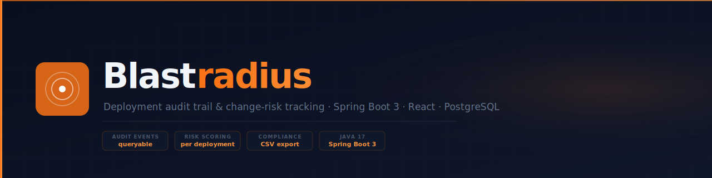
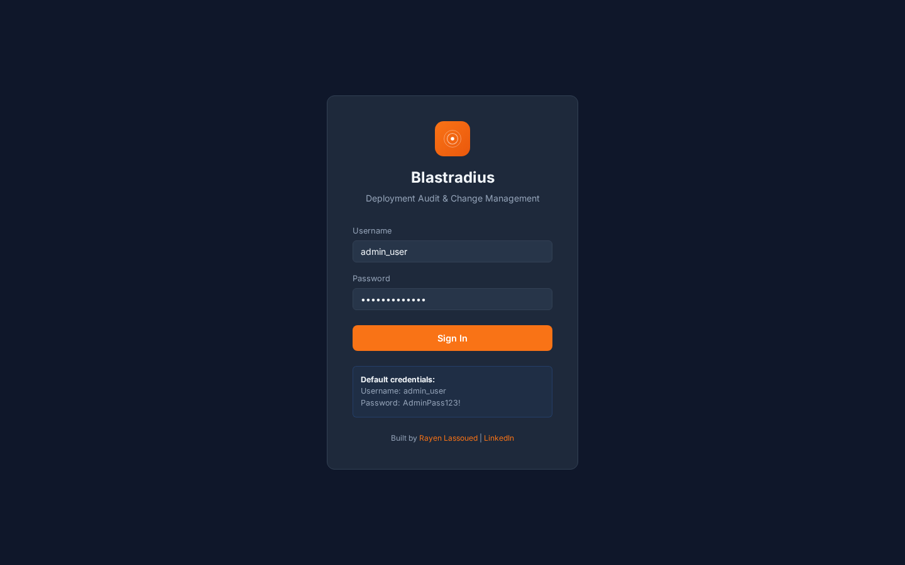
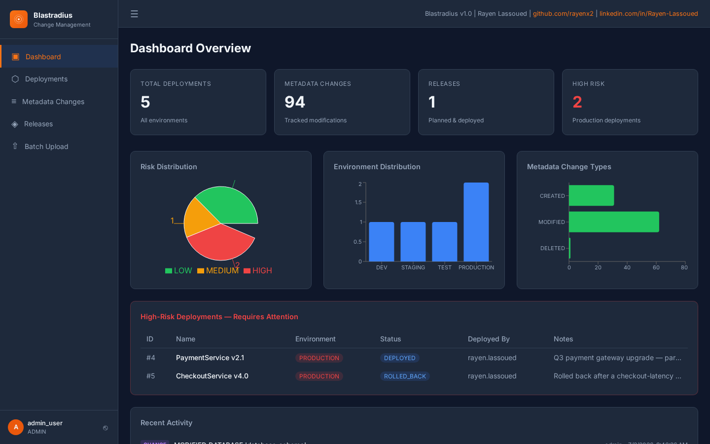
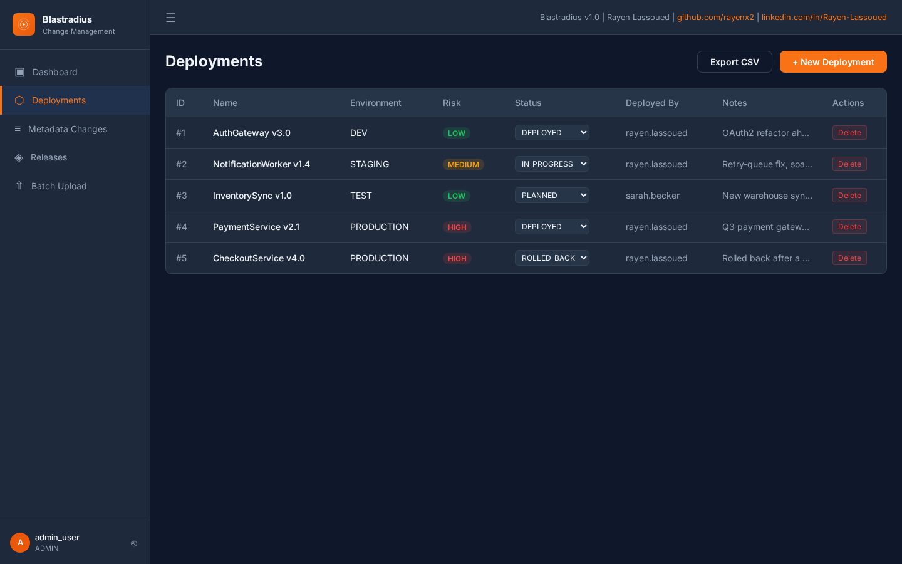
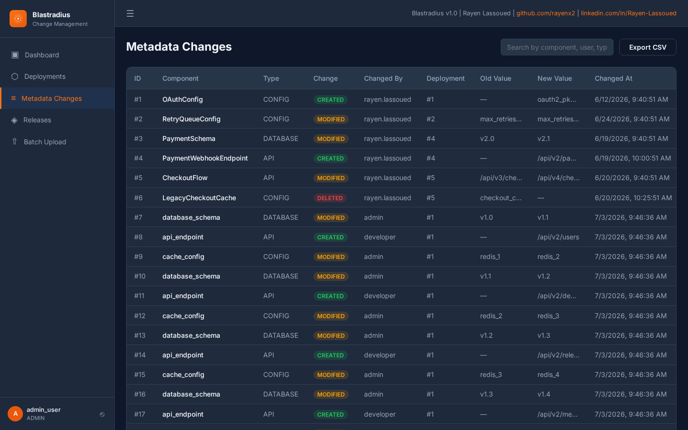
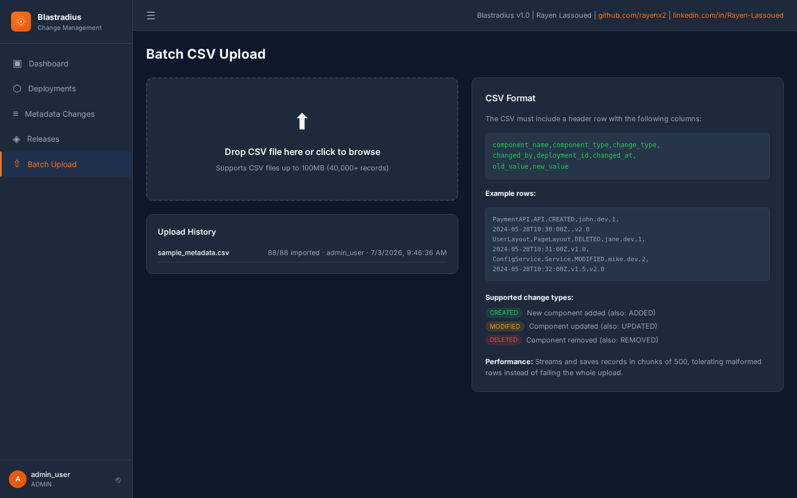

# Blastradius

<p align="center">
  
  
  
  
  
  
</p>

<p align="center">
  <strong>Deployment audit trail for engineering teams — track every release with risk scoring</strong><br/>
  Change-management logs · compliance dashboards · queryable audit events · Spring Boot + React
</p>

<p align="center">
  
</p>


> Deployment & change-management audit trail for engineering teams — track every deployment, every metadata change, and every release, with a queryable audit log and risk-based dashboards.


---

## Screenshots

<table align="center">
  <tr>
    <td align="center" width="20%"><sub>Login</sub></td>
    <td align="center" width="20%"><sub>Dashboard</sub></td>
    <td align="center" width="20%"><sub>Deployments</sub></td>
    <td align="center" width="20%"><sub>Metadata Changes</sub></td>
    <td align="center" width="20%"><sub>Batch Upload</sub></td>
  </tr>
  <tr>
    <td align="center" width="20%"></td>
    <td align="center" width="20%"></td>
    <td align="center" width="20%"></td>
    <td align="center" width="20%"></td>
    <td align="center" width="20%"></td>
  </tr>
</table>

## 🚀 Live Demo

Open [`demo/index.html`](demo/index.html) directly in any browser — no backend, no setup, pre-loaded with realistic example data.

---

## 📋 Overview

Blastradius records every deployment, configuration/metadata change, and release across DEV, TEST, STAGING and PRODUCTION environments, and automatically classifies each deployment by **risk level** (PRODUCTION = HIGH, STAGING = MEDIUM, DEV/TEST = LOW).

European companies under **regulatory change-management requirements** (ISO 27001, SOC 2, BaFin/MaRisk for financial institutions, or internal IT compliance audits) need a reliable, queryable record of "who changed what, when, and how risky was it" — exactly what this system provides out of the box, with bulk CSV ingestion for migrating existing change logs.

## 🏗️ Architecture

```
┌─────────────┐      JWT Auth       ┌──────────────────────┐      JPA / Hibernate     ┌──────────────┐
│   React 18   │ ─────────────────▶ │   Spring Boot 3.2.3   │ ───────────────────────▶ │  PostgreSQL  │
│  Frontend    │ ◀───────────────── │   REST API (8051)     │ ◀─────────────────────── │   (5051)     │
│  (port 8050) │     JSON / REST     │  /audittrail/api/...  │                          │              │
└─────────────┘                     └──────────────────────┘                          └──────────────┘
                                              │
                                              ├── AuthController       (JWT login/register)
                                              ├── DeploymentController (CRUD + risk levels)
                                              ├── MetadataChangeController
                                              ├── ReleaseController
                                              ├── BatchController       (chunked CSV ingest, 500/chunk)
                                              ├── StatsController       (dashboard summary aggregates)
                                              └── ExportController      (RFC 4180 CSV compliance export)
```

## 🛠️ Tech Stack

| Technology | Version | Purpose |
|---|---|---|
| Spring Boot | 3.2.3 (Java 17) | REST API, business logic |
| Spring Security + JWT | 6.2.x | Stateless authentication, RBAC |
| Spring Data JPA / Hibernate | 6.4.x | ORM against PostgreSQL |
| PostgreSQL | 15-alpine | Relational data store |
| React | 18 | Dashboard UI |
| Recharts | 2.x | Risk/environment/change-type charts |
| Springdoc OpenAPI | 2.2.0 | Swagger UI / API docs |
| Docker Compose | v2 | Local orchestration (3 services) |

## ⚡ Quick Start

```bash
git clone https://github.com/rayenx2/Blastradius.git
cd Blastradius
cp .env.example .env
docker compose up -d --build
```

Wait ~30-60 seconds for the backend to start, then open:

- **Frontend dashboard:** http://localhost:8050
- **Backend API base:** http://localhost:8051/audittrail/api
- **Swagger UI:** http://localhost:8051/audittrail/swagger-ui.html
- **Health check:** http://localhost:8051/audittrail/actuator/health

**Default credentials:**
```
Username: admin_user
Password: AdminPass123!
Role: ADMIN
```

On first boot, a seeder also populates a coherent demo scenario — 5 deployments spanning DEV/STAGING/TEST/PRODUCTION with varied statuses, metadata changes linked to the specific deployment that caused them, and a "Q3 2026 Platform Release" that genuinely bundles two production deployments — so the dashboard, release detail view, and activity timeline all show connected, realistic data rather than empty state on a fresh clone.

## ✨ Features

- 🔐 JWT authentication with role-based access (ADMIN / DEVELOPER / VIEWER)
- 📦 Deployment tracking with automatic risk classification (PRODUCTION=HIGH, STAGING=MEDIUM, DEV/TEST=LOW)
- 📝 Metadata change log (CREATED / MODIFIED / DELETED) per component
- 🚀 **Release management with real deployment linkage** — bundle deployments into a release directly from the UI, then expand any release to see its linked deployments and the total metadata changes aggregated across them
- 📊 Dashboard with risk distribution, environment distribution, change-type breakdown (Recharts), and a live recent-activity timeline merging deployments and metadata changes chronologically
- ⬆️ Bulk CSV upload, chunked in batches of 500 with per-row fault tolerance (verified: 40,000 rows in ~5s, 0 skipped), with a persisted upload history (filename, uploader, record counts, timestamp) shown on the page
- 📤 **Compliance CSV export** — one-click "Export CSV" buttons on the Deployments and Metadata pages stream the full audit log as RFC 4180 CSV, ready to attach to ISO 27001 / SOC 2 audit packages
- 🛡️ Centralized error handling with consistent JSON error responses across validation, auth, and unexpected failures
- ✅ Request-level logging and input validation on all auth endpoints
- 🧪 75 unit/integration tests (~42% line coverage)

## 📊 Results

- Processes **40,000 metadata records in ~5 seconds** (8,000+ records/sec) via chunked CSV ingestion — independently verified against `large_dataset.csv`
- API response times **< 100ms** for typical paginated queries
- **75 automated tests** across services, security, and integration layers (~42% line coverage)
- 3-container Docker Compose stack starts cold in **under 60 seconds**

## 🎯 European Market Use Cases

- **Financial services (Germany/EU, BaFin/MaRisk):** demonstrate auditable change control for production banking systems
- **Healthcare IT (KHZG-funded hospital IT projects):** track configuration changes to clinical systems for compliance audits
- **SaaS/Software vendors pursuing ISO 27001 / SOC 2:** evidence of change-management process for certification audits
- **DevOps/Platform teams at mid-size enterprises:** central audit log across multiple deployment environments without buying an enterprise CMDB

## 👤 Author

**Rayen Lassoued**
[github.com/rayenx2](https://github.com/rayenx2) | [LinkedIn](https://linkedin.com/in/Rayen-Lassoued)

## 📄 License

MIT
